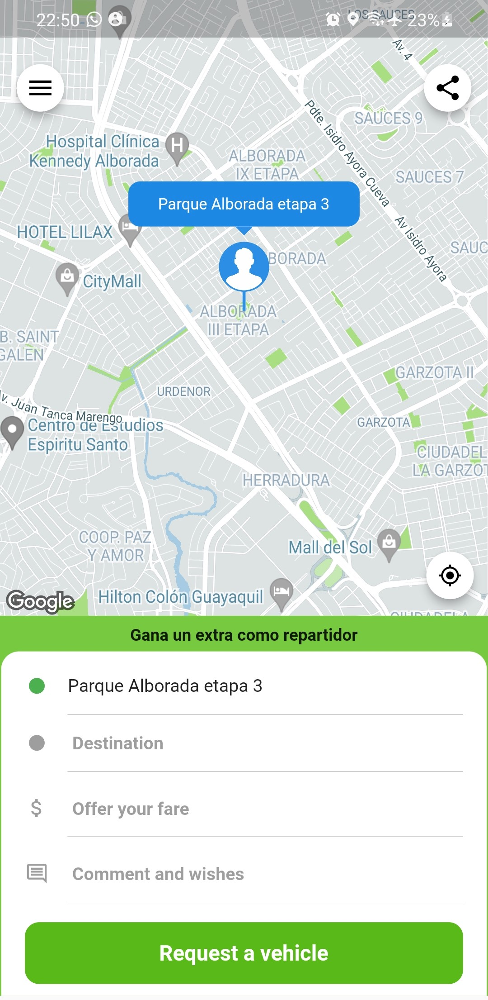

# indriver

A new Flutter project.

  

- Obtenga una clave de API aquí: https://cloud.google.com/maps-platform/ 
- Edite android/app/src/main/AndroidManifest.xml y establezca la clave de API

## Getting Started

This project is a starting point for a Flutter application.

For help getting started with Flutter development, view the
[online documentation](https://docs.flutter.dev/), which offers tutorials,
samples, guidance on mobile development, and a full API reference.
